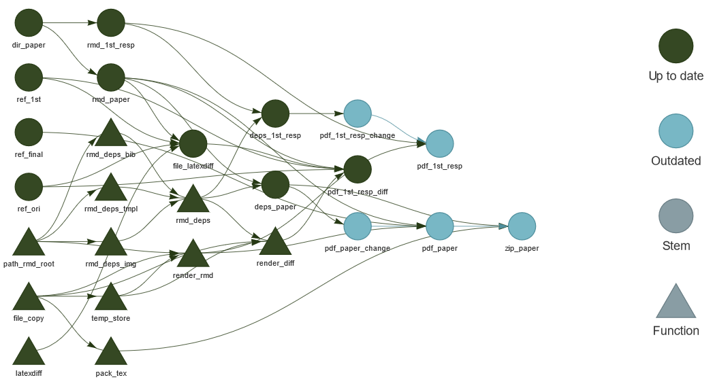

# {epwshiftr} BS2023 paper

This repository contains the research compendium for our paper:

    Jia, Hongyuan, Chong, Adrian, Ning, Baisong, 2023. Epwshiftr: incorporating open data of climate change prediction into building performance simulation for future adaptation and mitigation, in: Proceedings of Building Simulation 2023: 18th Conference of IBPSA, Building Simulation. Presented at the Building Simulation 2023, IBPSA, Shanghai, China, pp. 3201–3207. https://doi.org/10.26868/25222708.2023.1612

The compendium includes all the data and code needed to reproduce the analysis,
figures and text associated with the publication.

# Citation

Please cite the actual conference paper, use:

```bibtex
@inproceedings{jia2023epwshiftr,
  title = {Epwshiftr: Incorporating Open Data of Climate Change Prediction into Building Performance Simulation for Future Adaptation and Mitigation},
  shorttitle = {Epwshiftr},
  booktitle = {Proceedings of {{Building Simulation}} 2023: 18th {{Conference}} of {{IBPSA}}},
  author = {Jia, Hongyuan and Chong, Adrian and Ning, Baisong},
  year = {2023},
  series = {Building {{Simulation}}},
  volume = {18},
  pages = {3201--3207},
  publisher = {{IBPSA}},
  address = {{Shanghai, China}},
  doi = {10.26868/25222708.2023.1612}
}
```

# Repository Structure

```
./
├── renv.lock                   # File describing the packages for building the paper
│
├── abstract
│   ├── abstract.md             # The abstract submitted to the conference
│   └── reviews.md              # Reviewer comments on the abstract
│
├── full-paper
│   ├── template                # LaTeX template (for RMarkdown integration) for conference paper and response to reviewers
│   │   └── ...
│   │
│   ├── figures                 # Figures used in the paper
│   │   └── ...
│   │
│   ├── reviews
│   │   ├── 1st-round.md        # 1st Round reviewer comments
│   │   │
│   │   ├── 1st-round-resp.Rmd  # 1st Round responses to viewers in RMarkdown
│   │   ├── 1st-round-resp.tex  # 1st Round responses to viewers in LaTeX format (auto-generated)
│   │   ├── 1st-round-resp.pdf  # 1st Round responses to viewers in PDF format (auto-generated)
│   │   │
│   │   ├── 1st-round-diff.tex  # 1st Round revision with trakced changes in LaTeX format (auto-generated)
│   │   └── 1st-round-diff.pdf  # 1st Round revision with trakced changes in PDF format (auto-generated)
│   │
│   ├── references.bib          # The references in BibTeX format
│   ├── paper.Rmd               # Full paper in RMarkdown format
│   ├── paper.tex               # Full paper in LaTeX format (auto-generated)
│   ├── paper.pdf               # Full paper in PDF format (auto-generated)
│   └── paper.zip               # The final tex bundle for submission (auto-generated)
│
├── R                           # R scripts which contain helper functions
│   └── ...
│
└── _targets.R                  # The {targets} pipeline for managing the paper submission workflow

```

The `_targets.R` file contains the pipeline for auto-generated all LaTeX sources,
PDFs and Zip file for submission.



To run the pipeline:

```r
renv::restore() # for installing all required packages
targets::tar_make()
```

# Licenses

Text and figures: [CC-BY-4.0](http://creativecommons.org/licenses/by/4.0/)
