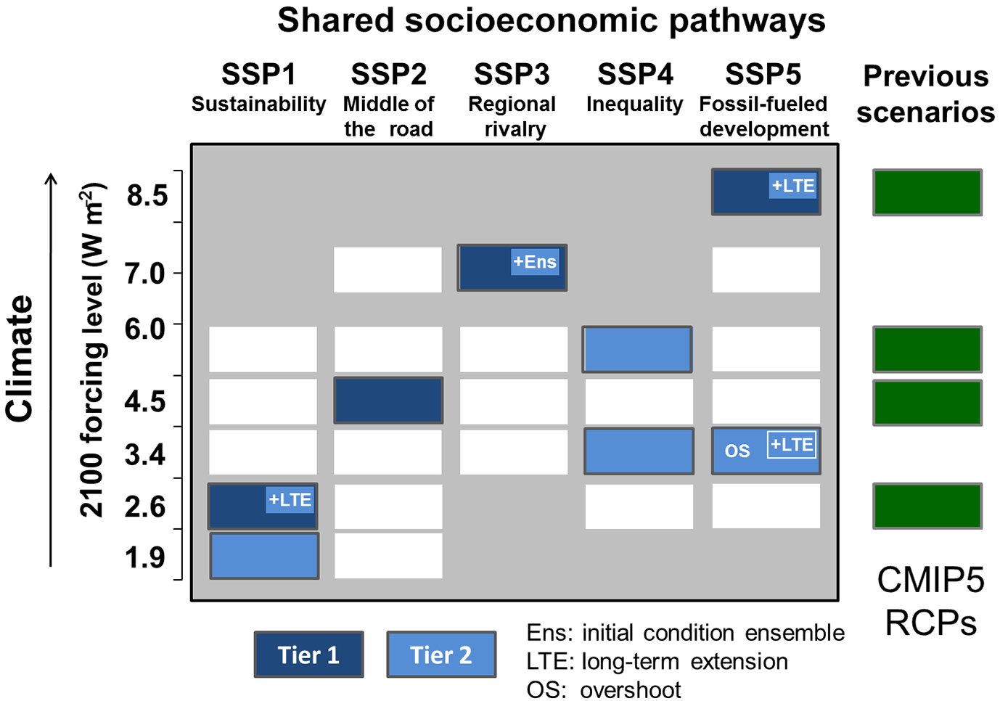
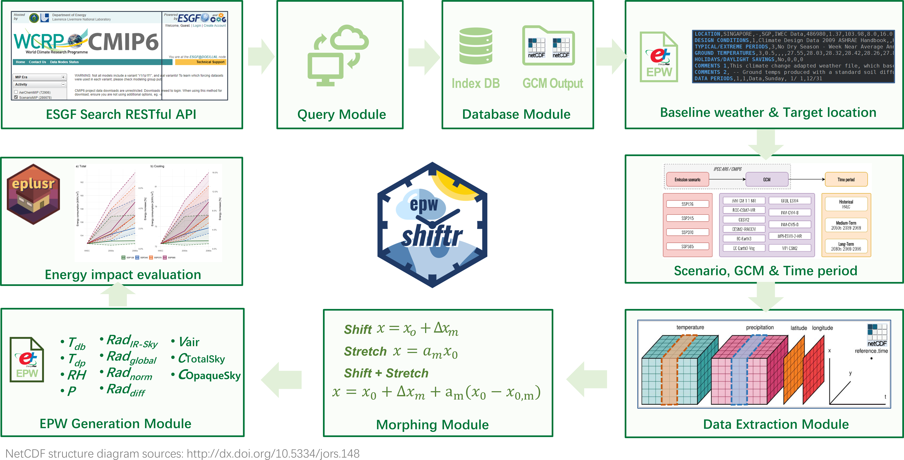
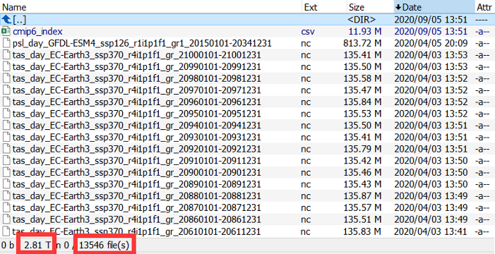

```{r setup, include = FALSE}
knitr::opts_chunk$set(
  warning = FALSE,
  message = FALSE,
  echo = TRUE,
  eval = FALSE,
  comment = "#>",
  out.width = "\\columnwidth"
)

hooks <- knitr::knit_hooks$get("source")
knitr::knit_hooks$set(source = function(x, options) {
  x <- hooks(x, options)
  if (!is.null(options$code.ref)) {
    x <- paste0("\\label{", options$code.ref, "}", x)
  }
  if (!is.null(options$code.cap)) {
    x <- paste0(c(
      "```{=latex}\n",
      "\\begin{Code}\n",
      "\\caption{", options$code.cap, "}\n",
      "```\n",
      x,
      "```{=latex}\n",
      "\\end{Code}\n",
      "```"
    ))
  }
  x
})
```

# Highlights

- A free open-source future weather generator `epwshiftr` was developed.
- It utilizes the latest CMIP6 ScenarioMIP experiment data
- It can automatically process significant amounts of climate change model data
  worldwide.
- It can generate future weather data for 11 meteorological variables.

# Introduction

Building energy simulation (BES) has become increasingly applied to assess
building performance under climate change and yield a more sustainable and
resilient design [@yassaghi2019overview]. Weather files form the boundary
conditions of BES and directly affect the results [@bhandari2012evaluation].
Therefore, it is necessary to use future weather data considering climate
change for the design and performance evaluation of new and existing buildings
[@picard2020robustness].

A rich body of research and development exists on weather generators for
creating future weather data for BES. In 2005, @belcher2005constructing proposed
the morphing method, a relatively simple statistical downscaling
method. It is based on the future climate change data predicted by the Global
Climate Model (GCM) and hourly weather data, usually a typical meteorological
year (TMY). Morphing can capture the average future weather conditions from GCM
while preserving historical weather sequences. It requires low computational
power, making it possible to create many weather files from worldwide locations.
However, morphing may under- or overestimate climate change impacts because of
the lacking of ability to capture future extreme weather conditions and
potential differences in the reference time frame of the TMY and GCM data
[@moazami2019impacts].
Moreover, careful consideration should be given to morphing when modifying
individual meteorological variables independently, breaking their physical
relationships. Despite these shortcomings, this method is still widely used
because of its simple and flexible characteristics.
Multiple morphing-based future weather
generators have been developed over the decades to integrate climate change
predictions from CMIP (Coupled Model Intercomparison Project) projects that
cover worldwide locations [@jentsch2008climate; @troup2016morphing;
@dickinson2016generating; @yassaghi2019overview]. Currently,
CCWorldWeatherGen[@jentsch2013transforming], WeatherShift
[@dickinson2016generating], and Meteonorm [@remund2020meteonorm] are three
future weather generators widely used in literature. CCWorldWeatherGen provides
a graphical interface based on Microsoft Excel to generate weather files in EPW
format supported by EnergyPlus directly. However, it is based on the A2 climate
scenario from the IPCC Third Assessment Report (TAR) published in 2001. Moreover,
it only utilizes data from a single GCM called HadCM3. Like CCWorldWeatherGen,
WeatherShift and Meteonorm also use morphing to generate EPW files for future
climate. They consider two representative concentration pathway (RCP) emission
scenarios, i.e., RCP4.5 and RCP8.5, from the 2014 IPCC Fifth Climate Change
Assessment Report (AR5). At the same time, both are commercial products, and the
weather data under a single climate scenario often cost hundreds of dollars.

Currently, the CMIP project is in its sixth phase (CMIP6), which has developed
new emission scenarios that have a similar range as the CMIP5, but fill critical
gaps for intermediate forcing levels [@oneill2016scenario]. IPCC
(Intergovernmental Panel on Climate Change) released the sixth climate
assessment report (AR6) based on CMIP6. It is based on the latest Shared
Socio-economic Pathway (SSP) climate change projections proposed by the CMIP6
ScenarioMIP experiment results.

Compared with the representative concentration pathway (RCP) scenarios in IPCC
AR5, the new scenarios based on SSP consider the impact of changes in
socio-economic factors on climate change, such as population, economic growth,
education, urbanization, etc [@chakraborty2021scenariobased]. Therefore,
existing research using outdated IPCC emission scenarios may not reasonably and
effectively represent the climate impacts and socio-economic risks of different
policy options.

Moreover, there are no easy-access tools for predicting future meteorological
parameters based on the latest SSP emission scenarios.

To this end, this paper proposes a future weather generation method for BES
based on CMIP6 ScenarioMIP climate scenarios, and develops a free and
open-source tool epwshiftr. It incorporates open data from the latest CMIP6
project into EnergyPlus Weather (EPW) generation using the morphing method. The
focus of this tool is to ease the burden of the cumbersome data preparation
process as much as possible while providing user-friendly and flexible ways to
create future EPWs for worldwide locations. It takes full advantage of data
query and fetching interfaces provided by the Earth System Grid Federation (ESGF)
portals where CMIP6 data are held. Epwshiftr can process multiple GCM outputs at
various spatial and temporal resolutions. Each module of epwshiftr stores data
in a standard data format, providing possibilities for exploring a considerably
broad pool of ready-to-use methods available for customized statistical
analysis. Most computational-intensive processes have been designed to run in
parallel for speed-up.

# Climate scenarios in CMIP6 ScenarioMIP

CMIP6 provides climate change simulation and forecast data and forms the
scientific basis of the IPCC assessment report. It approved 23 Model Comparison
Sub-Projects (MIPs). ScenarioMIP, one of those MIPs, aims to provide critical
data support for future climate change mechanism studies and corresponding
mitigation and adaptation research. The new climate projection scenarios
proposed by ScenarioMIP are rectangular combinations of different Shared
Socio-economic Pathways (SSPs) and the latest Representative Concentration
Pathways (RCPs):

1. SSP is used to describe the possible development scenarios of the future
   society without the influence of climate change or climate policy (CMIP6,
   2014). There are five SSP scenarios in ScenarioMIP, namely SSP1, SSP2, SSP3,
   SSP4, and SSP5, arranged in order of social development from good to bad,
   representing sustainable, moderate, partial, unbalanced, and normal
   development, respectively.

2. RCP represents the level of global radiative forcing, i.e., the amount of
   change in the net irradiance of the tropopause or the top of the atmosphere
   due to climate change until the end of this century. Based on the four
   radiative forcing levels in the CMIP5 RCP, ScenarioMIP added three new
   emission pathways, namely RCP2.6, RCP3.4, and RCP7.0, filling the gaps
   between the typical pathways of CMIP6 [@oneill2016scenario].

ScenarioMIP combines the above five SSP scenarios and seven RCPs to form eight
groups of future climate scenarios. They are grouped into Tier-1 and Tier-2
based on the modeling priority, with Tier-1 being the core test, as shown in
Figure \@ref(fig:ssp).

```{r}
#| ssp,
#| echo = FALSE,
#| eval = TRUE,
#| out.width = "0.7\\textwidth",
#| fig.env = "figure*",
#| fig.cap = "Scenario design matrix for future climate prediction based on SSP
#|   and RCP in ScenarioMIP\\citep{oneill2016scenario}"

```

# `epwshiftr`: a free, open-source future weather generation tool using CMIP6 ScenarioMIP data

Epwshiftr is developed using R [@RCoreTeam2019] language and distributed
using CRAN (Comprehensive R Archive Network)^[epwshiftr CRAN link:
https://cran.r-project.org/package=epwshiftr]. It can be downloaded for free
and run on common platforms, including Windows, macOS, and Linux. Epwshiftr is
open-source, and the source code is published on GitHub^[epwshiftr GitHub link:
https://github.com/ideas-lab-nus/epwshiftr]. Epwshiftr can be easily installed
via a single command as shown in Listing \ref{lst:install}.

```{r}
#| install,
#| eval = FALSE,
#| code.ref = "lst:install",
#| code.cap = "Install epwshiftr"
install.packages("epwshiftr")
```

Figure \@ref(fig:workflow) shows the primary process of using epwshiftr to
generate EPW files for future weather. It consists of five modules, including:

- ***Query Module***, which sends queries of the CMIP6 ScenarioMIP output using
  the Earth System Grid Federation (ESGF) portals;
- ***Database Module***, which is used to manage the massive raw climate change data
  of ScenarioMIP GCMs;
- ***Data Extraction Module***, which can extract climate change raw data based on
  geographic location information;
- ***Morphing Module***, which uses the morphing statistical downscaling method to
  calculate the predicted values of each meteorological variable at different
  future time periods and under different climate forecast scenarios;
- ***EPW Generation Module***, which uses the forecast data to generate EPW files
  under future climate change, based on the mapping between EPW weather
  variables and GCM output meteorological variables.

```{r}
#| workflow,
#| echo = FALSE,
#| eval = TRUE,
#| out.width = "0.7\\textwidth",
#| fig.env = "figure*",
#| fig.cap = "The primary process of using epwshiftr to generate EPW files for future weather"

```

The epwshiftr package follows the Test-Driven Development (TDD) process. Around
450 unit tests are carefully made, covering 94% of the codebase. They are
automatically run on Windows, macOS, and Linux whenever changes are made in
epwshiftr on CRAN and GitHub.

With the generated future meteorological data, future building loads and energy
demand under climate change can be predicted and evaluated. Many tools are
currently available to perform parametric BES. Eplusr [@jia2021eplusr], a rich
toolset for BES data-driven analyses, is one of them and can be integrated well
with epwshiftr. Evaluation of future building energy demand using generated
future weather data is not the focus of this paper. The following sections will
explain the implementation principle and technical details of epwshiftr by
module.

## Query ScenarioMIP GCM output using ESGF

CMIP6 is still an ongoing program in which global climatologists share, analyze,
and compare simulation results from the latest GCMs. All GCM outputs in CMIP6
are available for free download through the Earth System Grid Federation (ESGF).
ESGF provides GCM outputs in NetCDF format, a widely-used format in the earth
science domain. It divides the data based on climate variables, output
frequencies, GCMs, variant labels, earth grid types, time ranges, and other
dimensions.

Since each NetCDF file contains data of a complete global grid, the size of the
monthly global surface temperature forecast data for the next 20 years under a
single climate scenario can reach more than 1 GB. The CMIP6 ScenarioMIP contains
dozens of different GCMs, and the total size of all output files will get more
than 10 TB, making it impossible to download all of them for analysis.

The *Query Module* provides an interface utilizing the RESTful API provided by
ESGF. It thus is capable of querying all CMIP6 GCM outputs based on various
conditions, providing download links of NetCDF files. The query result will be
processed into a data frame that contains 22 metadata that describes each
output. Also, an output index is generated based on the query to
check the data integrity before extracting climate change data.

Listing \ref{lst:index} demonstrates how to use the `index_cmip6_index`
interface from the *Query Module*.

This snippet will send a query to ESGF to list all available daily outputs for
near-surface air temperature (tas) and relative humidity (hurs) from
AWI-CM-1-1-MR GCM first run (r1i1p1f1) under SSP585 climate scenario from the
ScenarioMIP activity for the year 2050 and 2080. Also, an output index file
named "cmip6_index.csv" will be saved.

```{r}
#| lst-index,
#| eval = FALSE,
#| code.ref = "lst:index",
#| code.cap = "Query ScenarioMIP outputs using the Query Module"
# generate GCM output index
idx <- init_cmip6_index(
  # only consider ScenarioMIP activity
  activity = "ScenarioMIP",

  # output variables of interest
  variable = c("tas", "hurs"),

  # report frequency
  frequency = "day",

  # experiment name
  experiment = "ssp585",

  # GCM name
  source = "AWI-CM-1-1-MR",

  # variant,
  variant = "r1i1p1f1",

  # years of interest
  years = c(2050, 2080),

  # save result as an output index file
  save = TRUE
)
```

## GCM raw output data management

As mentioned above, the size of NetCDF files can easily reach hundreds of GB or
even TB levels for multiple combinations of emission scenarios and GCMs, as
shown in Figure \@ref(fig:db). Therefore, it becomes cumbersome to manage such
massive data properly.

```{r}
#| db,
#| echo = FALSE,
#| eval = TRUE,
#| fig.cap = "GCM outputs in NetCDF files for 11 variables from 10 GCMs under 4
#|   climate scenarios from 2020 to 2100 take 2.81TB space with more than 13,000
#|   files"

```

Fortunately, CMIP6 requires each NetCDF file generated by GCM to contain
specific global attributes, which can be used to describe the data stored in the
file. Among them, 30 are mandatory and are included in every file. Therefore,
the *Database Module* creates a mapping between the ESGF query output and each
global attribute and manages the original big data of ScenarioMIP GCM climate
change. The computational load is small since the amount of data to extract from
the global attributes in NetCDF is negligible compared to the total data volume
of the time-series matrix. It should be pointed out that CMIP6 does not
require a specific calendar format for the time series GCM output. Various
calendars exist, including the standard calendar, proleptic Gregorian calendar,
365-day calendar, 366-day calendar, 360-day calendar, etc. Therefore, careful
attention has been paid when converting the time range information obtained from
ESGF and NetCDF files to ensure they are all transformed into the standard
calendar.

To speed up the data verification process, the *Database Module* uses
asynchronous parallel computing to extract and verify attributes of multiple
NetCDF files simultaneously. This parallel computing is also applied to all
other modules that perform computational-intensive procedures.

Listing \ref{lst:db} demonstrates how to use the `suumary_database` interface from the
Database Module to get a summary of NetCDF files downloaded against the CMIP6
output index generated using the *Query Module.* This step is necessary as it maps
the loaded files against the index so that epwshiftr knows which case is
complete and can be used for the next step.

```{r}
#| lst-db,
#| eval = FALSE,
#| code.ref = "lst:db",
#| code.cap = "Summarize the GCM NetCDF files based on the output index"
sm <- summary_database(
  # where all the NetCDF files are
  dir = getOption("epwshiftr.dir"),

  # criteria for calculating completeness
  by = c("source", "variable"),

  # what to do for duplications
  mult = "latest"
)
```

## Extraction of raw climate change data based on geographic location

When the integrity check has been passed, the next step is to extract the raw
time-series data from GCM NetCDF output files. NetCDF stores data as a
three-dimensional time, longitude, and latitude matrix. Therefore, the data can
be extracted through the target location's geographic location information
(latitude and longitude). However, the global grid from GCMs is often coarse.
The spatial resolution is generally around 50km to 100 km, making obtaining
accurate data of target locations challenging. In addition, the spacing of
longitude and latitude in the global grid is usually different. Currently, no
uniform standard method exists to calculate the distance between two points on a
global grid. The common methods are: (a) the Euler distance method, (b) the Tunnel
Distance method, and (c) the K-D tree algorithm. The Data Extraction Module uses the
Euler distance method. Moreover, it also provides parameters to specify the
distance threshold of longitude and latitude on the grid from the target
position and the maximum number of grid points to match. Similarly, all data
extraction processes are implemented in parallel to speed up.

Listing \ref{lst:data} demonstrates how to use the `match_coord` interface from
the *Data Extract Module* to extract all coordinates and data of grid points that
meet the specified requirements, i.e., the maximum geographical distance between
the matched grid points and selected location should be less than 0.5 degrees,
and only return the closest point. It also showcases the ability to directly
use an EPW file as input for coordinate matching, as epwshiftr can parse the
geographical information stored in EPW files.

The extracted raw data will be distinguished by six attributes: MIP, GCM,
climate scenario, output frequency, geographic location (longitude and latitude),
and climate variables. This makes the post-processing and analysis of raw
climate change data can be easily realized.

```{r}
#| lst-data,
#| eval = FALSE,
#| code.ref = "lst:data",
#| code.cap = "Match the global grid points directly using an EPW file and
#|   extract raw GCM data"
# use weather file distributed from
# EnergyPlus v8.8 as an example
epw <- eplusr::path_eplus_weather(
  ver = 8.8,
  file = "USA_CA_San.Francisco.Intl.AP.724940_TMY3.epw"
)

# extract matched grid coordinates
coord <- match_coord(
  epw,

  # match distance less than 0.5 degrees
  threshold = list(lon = 0.5, lat = 0.5),

  # match at most 3 grid points
  max_num = 3
)

# extract all data from matched grid points
data <- extract_data(coord,
  # specify the years to extract
  years = c(2050, 2080)
)
```

The size of the raw data extracted can be relatively big. For example, based on
the authors' measurements, it takes about 20G memory to read the raw data of 12
climate variables from 2020 to 2100 from 4 climate scenarios and 11 GCMs, which
is often close to, if not greater than, a typical PC's memory. For this reason,
epwshiftr supports storing the original data in the *fst* format [@mark2022fst]
with a super large compression ratio, greatly reducing the content burden
required for calculation. Still taking the above situation as an example, if the
data is divided by GCM, the size of a single fst file is only about 50MB, which
can be easily read and processed by current mainstream home computers.

## Generation of future weather data using morphing statistical downscaling

The *Morphing Module* is closely related to the EPW Generation Module and will
be described together in this section. After obtaining the raw GCM climate
prediction data, the last step is to generate EPW weather files that can be
directly used for energy simulation programs like EnergyPlus through the
Morphing statistical downscaling method. Compared with the time-consuming raw
data preparation process described above, generating climate files using
morphing statistical downscaling is relatively simple. The morphing method
involves calculating the future hourly weather parameter $x$ by applying a
stretching factor and/or a shifting factor to the original weather value $x_0$
(see Equation \ref{eq:morph-shift}-\ref{eq:morph-mixed}). It captures the
average climate change while preserving the physically realistic source weather
data sequences.

\begin{align}
\text{Shift:}         \: & x = x_0 + \Delta x_m \label{eq:morph-shift}\\
\text{Stretch:}       \: & x = \alpha _m x_m    \label{eq:morph-stretch}\\
\text{Shift+Stretch:} \: & x = x_0 + \Delta x_m + a_m ( x_0 - \langle x_0 \rangle _m ) \label{eq:morph-mixed}
\end{align}

where $x_0$ is the weather data for the current hour; $\Delta x_m$ is the mean
monthly change in the weather data x obtained from the GCMs; $\alpha _m$ is the
stretching factor; and $\langle x_0 \rangle$ is the monthly mean of the current
weather data.

Epwshiftr can generate future data for the following 11 weather variables:

* Dry-bulb temperature
* Dew-point temperature
* Relative humidity
* Atmospheric pressure
* Horizontal infrared radiation
* Total horizontal radiation
* Direct normal radiation
* Diffuse horizontal radiation
* Outdoor wind speed
* Total sky cover
* Opaque sky cover

To avoid unrealistic results, the *Morphing Module* has taken extra data
validation and calculation steps, including but not limited to:

* Warnings are generated if there are any missing values in the input EPW and
  GCM data.
* Unit conversions between data of EPW and GCM are automatically performed using
  the units [@pebesma2016measurement] R package, e.g. all temperature data have
  been converted to Celsius before calculation.
* Calculation of dew point temperature is performed based on dry-bulb
  temperature and relative humidity using the psychrolib [@meyer2019psychrolib]
  R package.
* Input values of relative humidity that exceed 100% will be reset to 100%.
* A threshold value is set for the stretch factor ($\alpha$), i.e. monthly-mean
  fractional change, when performing morphing operations. The default value is
  set to `3`. If the absolute $\alpha$ exceeds this threshold value, warnings
  are issued to suggest users further investigate the input data before
  continuing. Moreover, the morphing method will use the shift factor ($\Delta x$)
  to to avoid unrealistic morphed values.

Besides the efforts above, the *Morphing Module* always returns the calculated
$\Delta x$ and $\alpha$ values in dedicated columns, which provides
opportunities for detailed examination and custom statistical analyses.

At the same time, when generating EPW files, average processing can also be
performed based on GCM, output frequency, longitude, latitude, etc.

Listing \ref{lst:epw} demonstrates how to use the `morphing_epw` interface from
the *Morphing Module* and the `future_epw` interface from the *EPW Generation
Module* to perform morphing on the baseline EPW data and raw GCM data and
create future EPW files based on the GCM source, climate scenarios and time
interval. All EPW files will be saved into a separate folder.

```{r}
#| lst-epw,
#| eval = FALSE,
#| code.ref = "lst:epw",
#| code.cap = "Perform morphing and generate future EPWs"
# perform morphing
morphed <- morphing_epw(data,
  # years of interest
  years = c(2050, 2080)
)

# create future EPWs
epws <- future_epw(
  morphed,

  # how to group the output files
  by = c("source", "experiment", "interval"),

  # where to save all generated EPWs
  dir = tempdir(),

  # create folders for each group
  separate = TRUE,

  # overwrite existing files
  overwrite = TRUE
)
```

Currently, epwshiftr only supports the morphing method. But the `morphing_epw`
interface provides parameters to modify which factors should be used for each
meteorological variable, with meaningful defaults value given. For example,
radiation-related variables are, by default, morphed using the stretch factor,
avoiding unrealistic positive values at nighttime. The modular design pattern of
epwshiftr makes it decouple the data structure and the actual extrapolation
algorithm used. We are happy to explore the feasibility of supporting
alternative extrapolation algorithms in the future.

# Conclusion

This paper presents a free, open-source R package called epwshiftr for adapting
EnergyPlus Weather (EPW) files to incorporate climate change predictions using
the morphing method. It can utilize the latest CMIP6 ScenarioMIP experiment data
and automatically process significant amounts of climate change model data
worldwide. We hope this tool will significantly save the time and cost of
obtaining future weather data. It thus can support the analysis of future
building heating and air-conditioning demand, energy consumption, and carbon
emissions.

# Acknowledgements

This study was funded by Research Foundation of Chongqing University of Science
and Technology (project No. ckrc2021073) and the 111 project (Grant No. B13041),
The authors also thank the support from the Berkeley Education Alliance for
Research in Singapore (BEARS) for the Singapore-Berkeley Building Efficiency and
Sustainability in the Tropics (SinBerBEST) Program.

# References {-}
